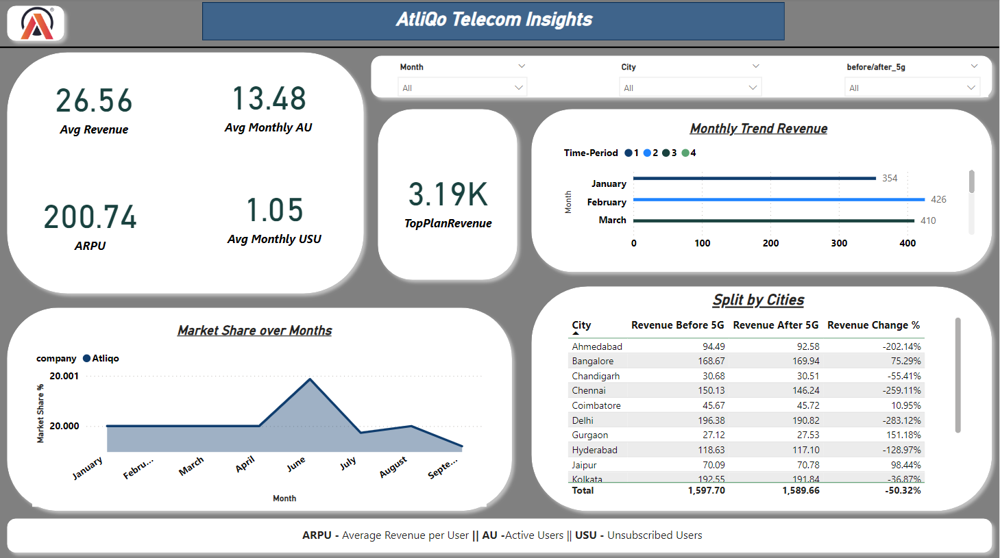

# 📡 AtliQo Telecom Insights

## 📌 Project Overview
The telecom industry generates a massive volume of data every day. In this project, we analyze AtliQo Telecom's data to gain valuable business insights using **Excel** and **Power BI**.

The main goal of this project is to support **data-driven decision-making** by identifying key metrics that influence customer retention, usage patterns, and revenue streams.

---

## 🎯 Project Goals & Key Insights
🔹 **Customer Churn Analysis**: Identify the most common causes of customer loss.  
🔹 **Demographic Segmentation**: Group customers based on age, region, and service usage.  
🔹 **Revenue Insights**: Explore revenue distribution and high-value customers.  
🔹 **Service Usage Behavior**: Visualize trends in data, calls, and other service metrics.  
🔹 **Retention Strategy Suggestions**: Provide business suggestions.

### ✅ Expected Outcomes
✔️ **Improved retention rates** through customer behavior analysis.  
✔️ **Enhanced customer experience** with targeted strategies.  
✔️ **Strategic decisions** supported by well-visualized data.

---

## 🛠 Technologies & Tools Used

| **Technology** | **Purpose** |
|----------------|-------------|
| 📊 **Excel** | Data Cleaning, Sorting, Pivot Tables |
| 📈 **Power BI** | Interactive Dashboards, KPI Reporting, Insights Visualization |

---

## 🖼️ Dashboard Screenshot
Below us a preview of the interactive Power BI dashboard used in this project:



## Clone the repository:
```bash
git clone https://github.com/AnalyticsWithNeha/AtliQo-Telecom-Insights.git
```
---

## 🤝 Contributing
Contributions are welcome! If you'd like to improve the analysis or add new features, feel free to fork the repository and submit a pull request.

---

## 📄 License
This project is licensed under the [MIT License](LICENSE).

## 📬 Contact
For any questions or feedback, feel free to reach out:
- **Name**: Neha Chauhan
- **Email**: analyticswithneha@gmail.com

---

## 🧭 How to Use the Project

1. Open the Power BI `.pbix` file to explore the interactive dashboard.
2. Use filters to explore data based on demographics and usage.
3. Refer to the insights section in the dashboard for business recommendations.

---

## 📂 Folder Structure

```plaintext
📦 AtliQo-Telecom-Insights  
 ┣ 📜 AtliQo-Insights.pbix   # PowerBI Dashboard
 ┣ 📜 README.md              # Project Documentation
 ┣ 📜 LICENSE                # MIT License